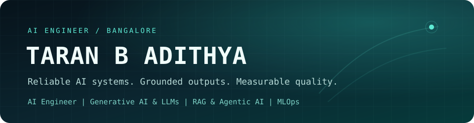
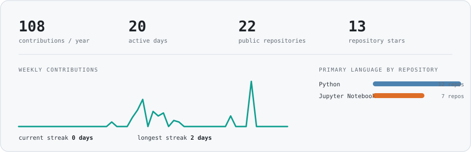

[LinkedIn](https://www.linkedin.com/in/taranaditya/) · [Featured work](#selected-work) · [Engineering principles](#how-i-build)

## About

I build AI systems with the parts that matter after the demo: evaluation, retrieval quality,
guardrails, auditability, reproducible deployment, and measured latency.

My recent work spans production RAG, LLM regression testing, safe Text-to-SQL, hybrid visual
search, and real-time Windows audio. I am currently focused on **AI/ML engineering roles** where
model quality and software reliability are treated as one problem.

## Technical skills

**Programming** 
`Python` `SQL`

**Generative AI & Agentic Systems** 
`RAG` `AI Agents` `LangChain` `LangGraph` `MCP` `Ollama` `vLLM` `Prompt Engineering` `DeepEval` `RAGAS`

**Machine Learning & Computer Vision** 
`PyTorch` `TensorFlow` `Scikit-learn` `OpenCV` `Ultralytics YOLO` `OpenCLIP`

**MLOps & Cloud** 
`Docker` `Kubernetes` `Kubeflow` `KServe` `GitHub Actions` `MLflow` `AWS EC2` `AWS S3` `Amazon ECR` `SageMaker`

**APIs, Databases & Retrieval** 
`FastAPI` `SQLAlchemy` `PostgreSQL` `MongoDB` `ChromaDB` `FAISS` `BM25`

## Selected work

### [Hybrid Docs RAG](https://github.com/prospeck/hybrid-docs-rag)

Production-oriented retrieval over internal documentation with dense + BM25 hybrid search,
reciprocal-rank fusion, reranking, verified inline citations, confidence scoring, and a golden
evaluation suite.

`RAG` · `hybrid retrieval` · `reranking` · `citation verification` · `FastAPI`

### [LLM Regression Guard](https://github.com/prospeck/llm-regression-guard)

CI/CD quality gates for prompt and model changes: versioned prompts, human-labelled golden data,
multidimensional scoring, baseline diffs, slow-drift detection, HTML reports, and Slack-ready
alerts.

`LLM evaluation` · `CI/CD` · `drift detection` · `SQLite` · `GitHub Actions`

### [Guarded Text-to-SQL](https://github.com/prospeck/guarded-text-to-sql)

Schema-aware natural-language analytics with AST safety checks, read-only execution, row and
complexity limits, query-plan inspection, hallucination signals, result sanity checks, and an
auditable query history.

`Text-to-SQL` · `guardrails` · `DuckDB` · `SQLAlchemy` · `hallucination detection`

### [Hybrid Visual Search](https://github.com/prospeck/hybrid-visual-search)

Natural-language image retrieval fused with YOLO11 object-count constraints and persistent FAISS
search. The measured CPU baseline indexed 30 COCO images at **6.239 images/s** and searched at
**56.676 ms p50 / 70.754 ms p95**.

`computer vision` · `YOLO11` · `OpenCLIP` · `FAISS` · `Streamlit`

### [Downmix Renderer](https://github.com/prospeck/Downmix-renderer-windows)

Windows desktop audio software for real-time 7.1/9.1.6-to-stereo downmixing and parametric EQ,
with device routing, native DSP boundaries, telemetry, liveness recovery, and packaged-release
verification.

`C/C++` · `Python` · `Qt` · `WASAPI` · `real-time audio`

### [MLOps Phishing Detection Platform](https://github.com/prospeck/Network-Security)

End-to-end network-security ML pipeline for phishing URL detection, achieving **98.8% accuracy on
11K+ samples** with a Random Forest model. Automated validation, training, containerization,
model versioning, and deployment across Amazon ECR, EC2, and S3.

`machine learning` · `MLOps` · `AWS` · `Docker` · `GitHub Actions` · `MLflow`

## Activity

The activity panel is generated inside this repository from GitHub's GraphQL API. No
third-party badge service, tracking pixel, or external image host is used.
